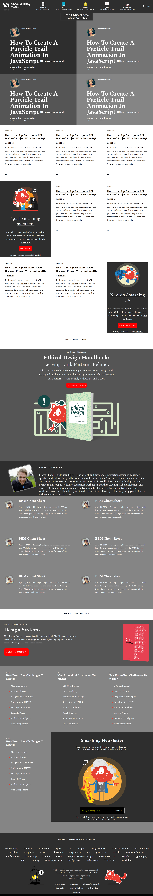

# smashing-magazine-grey

This is a microverse project focusing on design and UX. It was developed as a requirement for Microverse HTML and CSS course.

Additional description about the project and its features.
In this Microverse project, we made use of float, grid and flex CSS principles to make a clone of a [Smashing Magazine](https://www.smashingmagazine.com/) page . Also, CSS background image principles were implemented.

## Built With

- Html
- CSS

## Live Demo

[Live Demo Link](https://rawcdn.githack.com/krys2fa/smashing-magazine-grey/2a4a0969d63b07dab8f5e1e2217fe702e4c79967/index.html)

## Getting Started

**Click on the link above in order to see the Live Demo of the front end project.**

To get a local copy up and running follow these simple example steps.

### Prerequisites

- Web Browser
- Text Editor

### Setup

- Download repository files

## Authors

👤 **Author1**

- Github: [@krys2fa](https://github.com/krys2fa)
- Twitter: [@krys2fa](https://twitter.com/krys2fa)
- Linkedin: [linkedin](https://www.linkedin.com/in/christopher-amanor-81a7b93b/)

👤 **Author2**

- Github: [@krys2fa](https://github.com/krys2fa)
- Twitter: [@krys2fa](https://twitter.com/krys2fa)
- Linkedin: [linkedin](https://www.linkedin.com/in/christopher-amanor-81a7b93b/)

## 🤝 Contributing

Contributions, issues and feature requests are welcome!

Feel free to check the [issues page](issues/).

## Show your support

Give a ⭐️ if you like this project!

## Acknowledgments

- Hat tip to anyone whose code was used
- Inspiration
- etc

## 📝 License

This project is [MIT](lic.url) licensed.
